# 👾 Minimax Games

This repository presents an implementation of the `minimax algorithm`, enhanced with `alpha-beta pruning`, designed for `AI decision-making in competitive search scenarios and games`. It showcases the algorithm through two straightforward examples: the Stone Taking Game and Tic Tac Toe. Additionally, it features game tree visualization utilizing the NetworkX library, providing insights into the decision-making process employed by adversarial search algorithms.

<p align="center">
    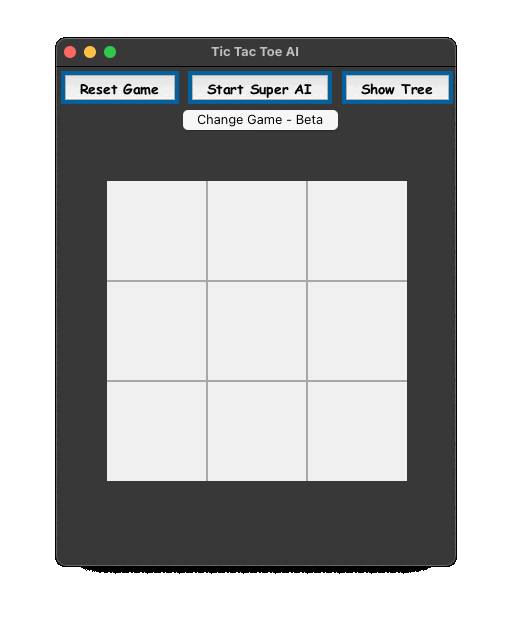
    <em><br>Interactive Tic Tac Toe Gameplay</em>
</p>

---

- [📚 Background](#-background)
- [🧩 Algorithm Design](#-algorithm-design)
- [🎮 Example Games](#-example-games)
  - [❌⭕️ Tic Tac Toe](#️-tic-tac-toe)
  - [🪨 Stone Taking Game](#-stone-taking-game)
- [📋 Prerequisites](#-prerequisites)
- [🏃‍♂️ How to Run](#️-how-to-run)
- [🕹️ Game Play](#️-game-play)
- [📝 Feedback](#-feedback)
- [📜 License](#-license)

---

## 📚 Background

A game tree is a structure resembling a tree, used to illustrate the potential moves and outcomes in a game. However, its practicality is limited due to the exponential growth of nodes in relation to the tree's depth. For instance, in a game with merely two options per move and a tree depth of 10, we would end up with $2^{10} = 1024$ nodes. In more intricate games, such as chess, the number of nodes can escalate to $10^{120}$, surpassing the total number of atoms in the universe.

<p align="center">
    
    <em><br>This is a visualization of the expansion of a Tic-Tac-Toe game tree.
    <br>The utility values are represented by purple squares and smaller red squares.
    <br>Visuals of the complete search are available in the attached images.</em>
</p>

The minimax algorithm is a decision-making tool used to determine the best move for a player in a game. It represents an enhancement over the brute force algorithm, which assesses all potential moves and their results. The premise is that for certain games, we can forecast the game's outcome if both players employ optimal strategies, without the need to evaluate every possible move. For instance, consider the following board configuration in a game of Tic Tac Toe:

$$
\left(\begin{array}{ccc}
  &   &  X\\
O &  & \\
X & O & X
\end{array}\right)
$$

Regardless of the move 'O' makes, 'X' can secure a win. Give it a try! This is why we can cease evaluating the game tree once we identify moves that the opposing player can execute, leading to our defeat.

The minimax algorithm operates by recursively evaluating the game tree. It commences at the tree's root and continues to expand the tree until it reaches a terminal (leaf) node. For instance:

$$
\left(\begin{array}{ccc}
  &   & [X]\\
O & [X] & O\\
[X] & O & X
\end{array}\right)
$$

This is a terminal node since 'X' can secure a win. The algorithm evaluates the utility of this node and relays it back to the parent node. Subsequently, the parent node assesses the utility of its child nodes. Here's where it gets interesting - let's assume the parent node represents the first player (max node) and the child nodes represent the second player (min nodes). Contrary to what you might expect, the algorithm selects the minimum utility from the child nodes: the max node chooses the maximum of the minimums, and the min node selects the minimum of the maximums. This counterintuitive approach is why it's called the minimax algorithm. Personally, I find it helpful to consider it as the player's least detrimental option.

The algorithm then backtracks the utility of the child nodes to the parent node, all the way up to the root node, which can then determine the optimal move for the player. The following diagram illustrates the game trees for the Stone Taking Game and Tic Tac Toe, showcasing the minimax decision-making process.

<p align="center">
    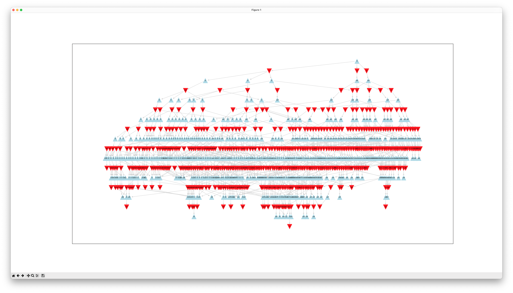
    <em><br>Minimax Decision Tree for the Stone Taking Game.
    <br>The Red Nodes Represent the Min ply and the Blue Nodes Represent the Max ply.
    <br>The Numbers on the Nodes Represent the different between the Max and Min scores.</em>
</p>

<p align="center">
    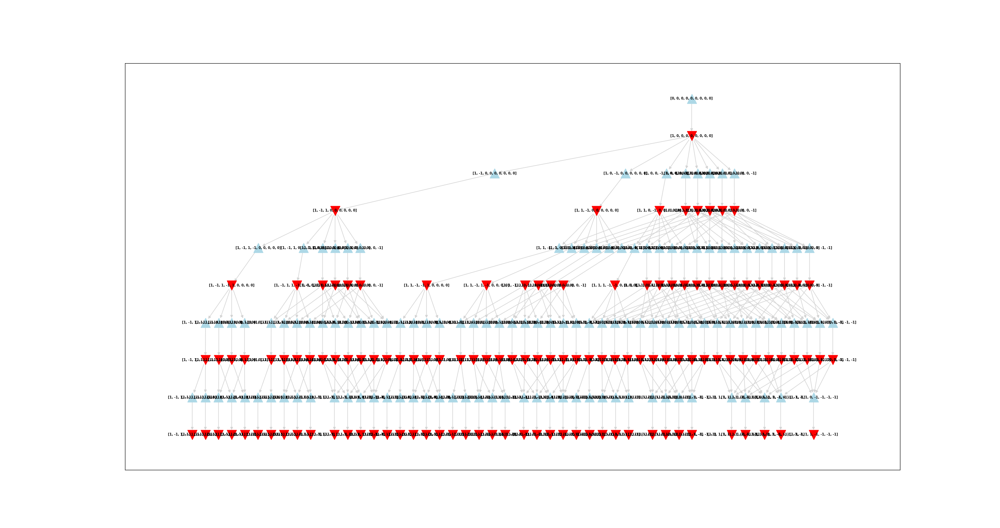
    <em><br>Part Tic Tac Toe Minimax Decision Tree</em>
</p>

<p align="center">
    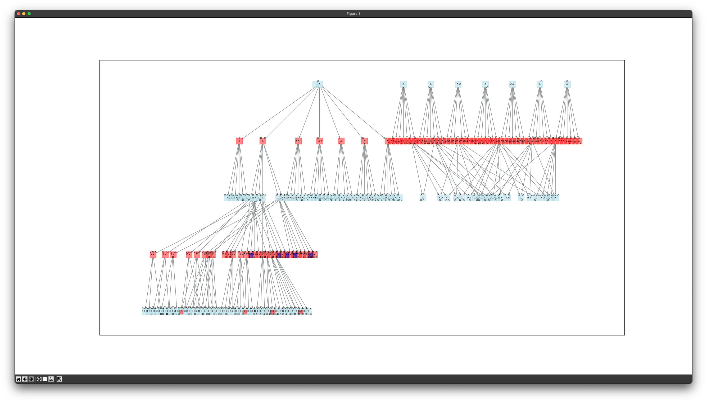
    <br>
    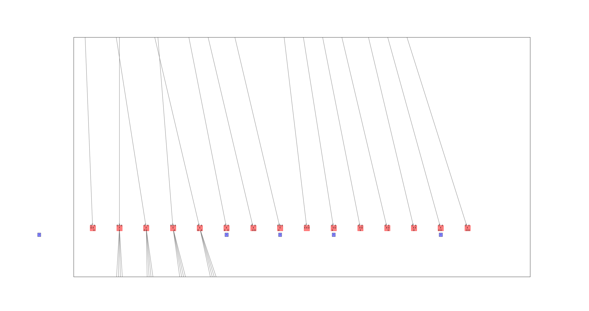
    <em><br>Zoomin of part of the Tic Tac Toe Minimax Decision Tree</em>
</p>

The minimax algorithm is a powerful tool for decision-making in games, but it has its limitations. The game tree's exponential growth can lead to an impractical number of nodes, rendering the algorithm inefficient. This is where alpha-beta pruning comes into play. It is a technique used to reduce the number of nodes evaluated by the minimax algorithm, enhancing its efficiency. The algorithm employs a cutoff mechanism, which ceases the evaluation of nodes that are no longer relevant to the decision-making process. This is achieved by maintaining two values, alpha and beta, which represent the best value for the max and min nodes, respectively. The algorithm then compares the utility of the nodes to these values, and if the utility exceeds the alpha or beta value, the node is pruned. The following diagram illustrates the alpha-beta pruning process, showcasing the nodes that are pruned from the game tree.

## 🧩 Algorithm Design

```python
class GameLogic:
    """
    GameLogic class
    """

    def __init__(self):
        self.state = []
        self.rules = ""
        self.player_score = 0
        self.computer_score = 0

    def actions(self, state: List[int]) -> List[int]:
        """
        Generates a list of possible actions based on the current state
        """
        pass

    def result(self, state: List[int], action: int) -> (List[int], int):
        """
        Returns the resulting state gained by applying the action to the current state
        """
        pass

    def is_terminal(self, state: List[int]) -> str:
        """
        Determines whether the current state is a terminal state
        """
        pass

    def utility(self, state: List[int], player: int) -> int:
        """
        Determines the utility of the current state based on the player and the game type
        """
        pass


    def __type__(self):
        """
        return the type of the game
        """
        pass
```

This program employs the principles of the minimax algorithm and alpha-beta pruning, applicable to any game type. The game logic is entirely encapsulated within the `GameLogic` class, serving as a foundational class for games. It can be adapted for use in any other game. The `StoneGame` and `TicTacToe` classes serve as examples, demonstrating how to utilize the `GameLogic` class.

```python
# part of the minimax algorithm with alpha-beta pruning - from the Minimax class
    def min_value(self, state: List[int], alpha: int, beta: int, depth: int, iterations: int = 10) -> (int, int):
        """
        Returns the minimum value and the action that leads to that value
        """
        v = inf
        best_move = None
        if self.game.is_terminal(state, MIN):
            v = self.game.utility(state, MIN)
        else:
            for a in self.game.actions(state):
                new_state = self.game.result(state, a)
                v2, a2 = self.max_value(
                    new_state, alpha, beta, depth + 1, iterations-1)
                if v2 < v:
                    best_move = a
                    v = v2
                beta = min(beta, v2)
                if v <= alpha:
                    break
        return v, best_move
```

## 🎮 Example Games

Each game utilizes a the `Game` class, which is a base class for the games. It contains the transition function, which is used to generate the next state of the game, and the utility function, which is used to evaluate the game state. The `StoneGame` and `TicTacToe` classes inherit from the `Game` class and implement their own transition and utility functions.

<p align="center">
    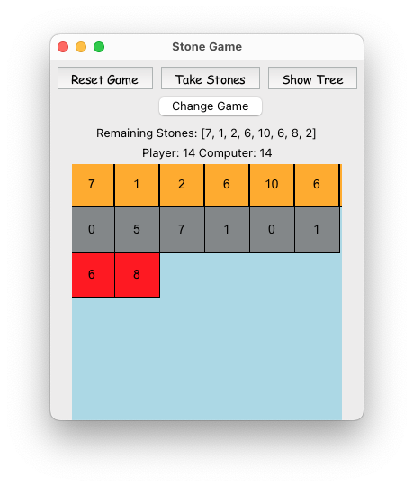
    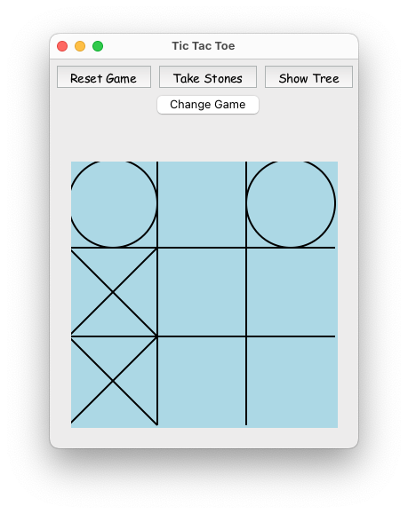
</p>


### ❌⭕️ Tic Tac Toe

<p align="center">
    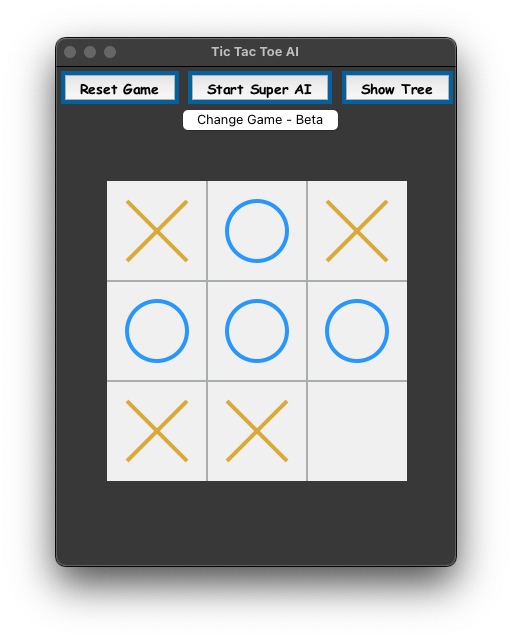
    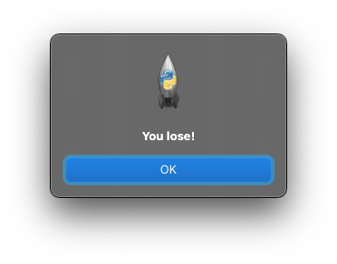
    <em><br>Dialog Window with Game Results</em>
</p>

The game features a graphical user interface (GUI) for interaction and visualizes the game strategy using a minimax algorithm tree. It is designed to provide an engaging and interactive experience for players while demonstrating the minimax algorithm's capabilities.

The following figures illustrate a boarder game tree for the Tic Tac Toe game, showcasing the minimax decision-making process:

<p align="center">
    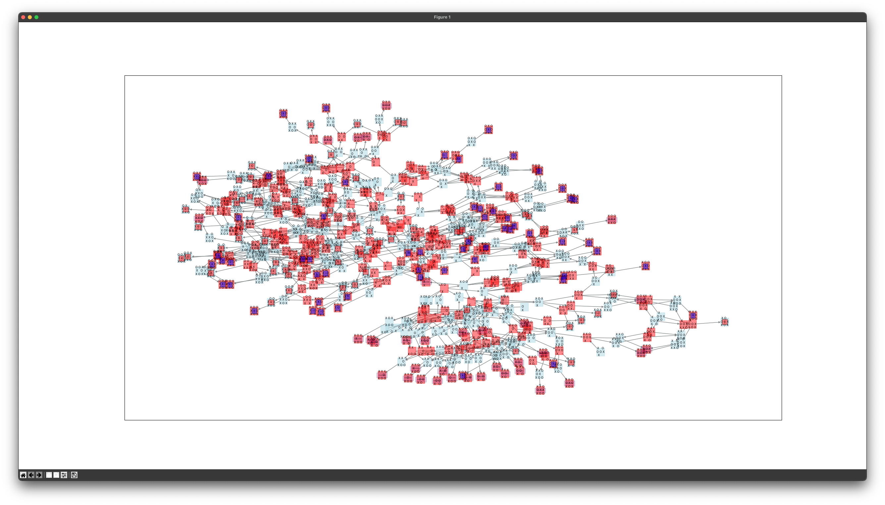
    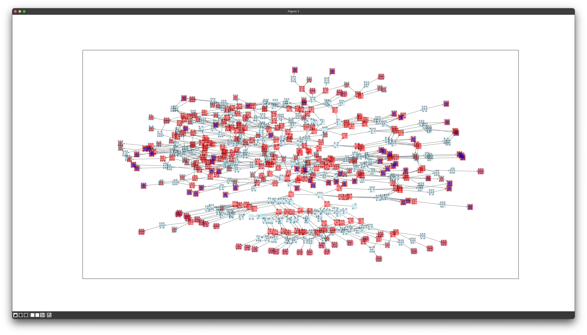
    <em><br>Part Tic Tac Toe Minimax Decision Tree
    <br>Purple leafs mark prunings.</em>
</p>

### 🪨 Stone Taking Game

**Note**: This game is currently not work with the latest version of the minimax algorithm, it will be updated soon.

The game was initially introduced as a `Hard` problem on LeetCode <https://leetcode.com/problems/stone-game-iii/>. While this implementation doesn't apply to the LeetCode problem, it remains an entertaining game to engage in. Its primary objective is to illustrate the minimax algorithm, providing an interactive platform for players. Additionally, it offers insights into the game's decision-making process and the alpha-beta pruning algorithm.

Specific to the Stone Taking Game, the Algorithm implementation uses the different between the player and the computer scores as the utility of the game. This lead to the first player (max node) to try to maximize the utility of the game, and the second player (min node) to try to minimize the utility of the game , wich is equivalent to maximize his own utility (less for player 1 mean more for player 2).

Included Features:

- **Player vs. Computer Gameplay**: Take turns with the computer to remove 1-3 stones from the pile.
- **Minimax Algorithm**: The computer calculates its moves using the minimax algorithm, ensuring a challenging game.
- **GUI Interaction**: The game uses Tkinter for the GUI, making it interactive and user-friendly.
- **Visualization**: Utilizes NetworkX for visualizing the minimax strategy tree, offering insight into the game's decision-making process.
- **Dynamic Stone Pile**: The number of stones and their values in the pile can be randomized for each game, ensuring a unique experience every time.

## 📋 Prerequisites

Before running the game, ensure you have the following installed:

- Python 3.x
- Tkinter
- NetworkX
- Matplotlib
- PyDot (for tree visualization)

## 🏃‍♂️ How to Run

1. Clone the repository or download the game file.
2. Ensure you have all the necessary libraries installed.
3. Run the script using Python:

```bash
python3 main.py
```

## 🕹️ Game Play

1. **Starting the Game**: Upon launching, the game will display a pile of stones with randomized values.
2. **Making a Move**: Enter the number of stones you wish to take (1, 2, or 3) and click "Take Stones".
3. **Computer's Turn**: After your move, the computer will calculate its best move and take stones accordingly.
4. **Visualization**: Click "Show Tree" to visualize the minimax decision tree for the current state of the game.
5. **End of Game**: The game ends when there are no more stones to take. The player with the most stones wins.

## 📝 Feedback

We love to hear from players! If you have any feedback, suggestions, or issues, please open an issue in the repository.

## 📜 License

This project is licensed under the MIT License - see the [LICENSE](LICENSE) file for details.
