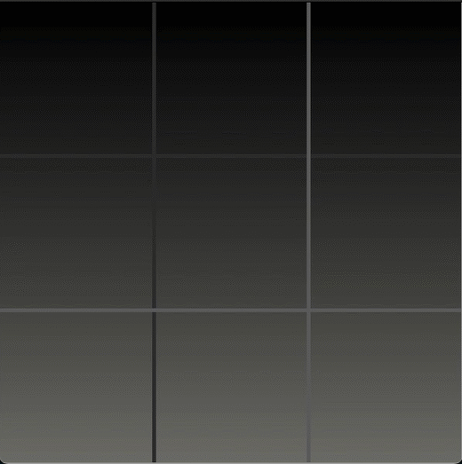
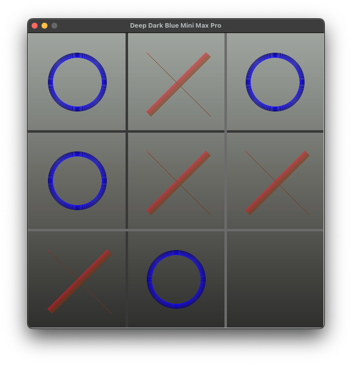
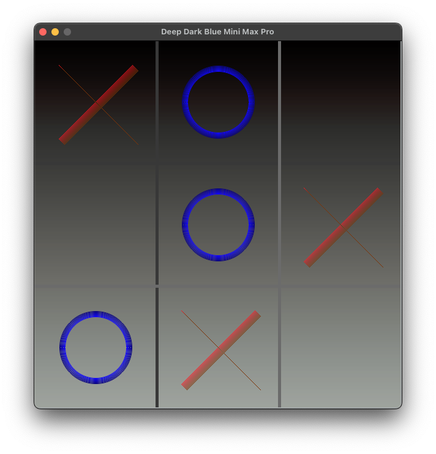
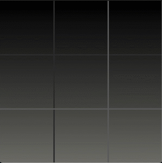
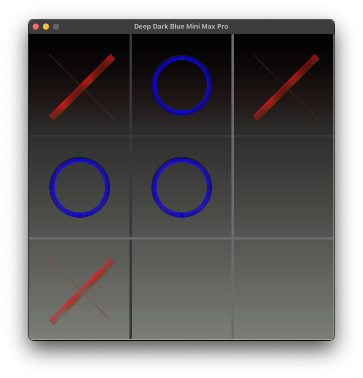

# 👾 Deep Dark Blue Mini Max

This repository presents an implementation of the `minimax algorithm`, enhanced with `alpha-beta pruning`, designed for `AI decision-making in competitive search scenarios and games`. It showcases the algorithm through two straightforward examples: the Stone Taking Game and Tic-tac-toe. Additionally, it features game tree visualization utilizing the NetworkX library, providing insights into the decision-making process employed by adversarial search algorithms.

<p align="center">
    
    <em><br>Interactive Tic-tac-toe Gameplay</em>
</p>

---

- [🚀 Update: Pygame Support](#-update-pygame-support)
- [📚 Background](#-background)
- [🧩 Algorithm Design](#-algorithm-design)
- [🎮 Example Games](#-example-games)
  - [❌⭕️ Tic-tac-toe](#️-tic-tac-toe)
  - [🪨 Stone Taking Game](#-stone-taking-game)
- [📋 Prerequisites](#-prerequisites)
- [🏃‍♂️ How to Run](#️-how-to-run)
- [🕹️ Game Play](#️-game-play)
- [📝 Feedback](#-feedback)
- [📜 License](#-license)

---

## 🚀 Update: Pygame Support

The program now supports the `Pygame` library, offering an enhanced gaming experience with improved graphics and interactivity. To use the Pygame GUI, simply run the `threed.py` script - the game will launch in a Pygame window. The Pygame GUI provides a more engaging and visually appealing interface for players, enhancing the overall gaming experience.

<p align="center">
    
    
</p>

## 📚 Background

A game tree is a structure resembling a tree, used to illustrate the potential moves and outcomes in a game. However, its practicality is limited due to the exponential growth of nodes in relation to the tree's depth. For instance, in a game with merely two options per move and a tree depth of 10, we would end up with $2^{10} = 1024$ nodes. In more intricate games, such as chess, the number of nodes can escalate to $10^{120}$, surpassing the total number of atoms in the universe. The Tic-Tac-Toe game tree, however, is considered relatively small, with fewer than $9! = 362,880$ terminal nodes, of which only about $5,000$ are distinct states. You can see the exponential growth of its game tree in the following GIF (frames available in the [tree_gif](images/tree_gif) folder).

<p align="center">
    
    <em><br>Vsualization of the expansion of a Tic-Tac-Toe game tree.
    <br>The utility values are represented by purple squares and smaller red squares.</em>
</p>

The minimax algorithm is a decision-making tool used to determine the best move for a player in a game. It represents an enhancement over the brute force algorithm, which assesses all potential moves and their results. The premise is that for certain games, we can forecast the game's outcome if both players employ optimal strategies, without the need to evaluate every possible move. For instance, consider the following board configuration in a game of Tic-Tac-Toe:

$$
\left(\begin{array}{ccc}
  &   &  X\\
O &  & \\
X & O & X
\end{array}\right)
$$

Regardless of the move 'O' makes, 'X' can secure a win. Give it a try! This is why we can cease evaluating the game tree once we identify moves that the opposing player can execute, leading to our defeat.

The minimax algorithm operates by recursively evaluating the game tree. It commences at the tree's root and continues to expand the tree until it reaches a terminal (leaf) node. For instance:

$$
\left(\begin{array}{ccc}
  &   & [X]\\
O & [X] & O\\
[X] & O & X
\end{array}\right)
$$

This is a terminal node since 'X' can secure a win. The algorithm evaluates the utility of this node and relays it back to the parent node. Subsequently, the parent node assesses the utility of its child nodes. Here's where it gets interesting - let's assume the parent node represents the first player (max node) and the child nodes represent the second player ($Min$ nodes). Contrary to what you might expect, the algorithm selects the minimum utility from the child nodes: the max node chooses the maximum of the minimums, and the $Min$ node selects the minimum of the maximums. This counterintuitive approach is why it's called the minimax algorithm. Personally, I find it helpful to consider it as the player's least detrimental option.

Formally, the minimax algorithm operates as follows:

$$
\text{{node value}} =
\begin{cases}
\text{{utility}} & \text{{if terminal node}}, \\
\max(\min(\text{{children values}})) & \text{{if Max node}}, \\
\min(\max(\text{{children values}})) & \text{{if Min node}}.
\end{cases}
$$

Or alternatively, if we consider nodes as states and actions, the algorithm can be represented as follows:

$$
\mathrm{max\_value}(state) = \max_{a \in \mathrm{actions}(state)} \mathrm{min\_value}(\mathrm{result}(state, a))
$$

$$
\mathrm{min\_value}(state) = \min_{a \in \mathrm{actions}(state)} \mathrm{max\_value}(\mathrm{result}(state, a))
$$

Where:
- `state` represents the current state of the game (node in the game tree to be precise).
- `actions` represents the possible moves the player can make.
- `result` represents the state of the game after the player makes a move.

The algorithm backtracks from the child nodes to the parent node, propagating the utility values up to the root node. This allows the root node to determine the optimal move for the player. The utility values depend on the game's specific logic. For instance, in the stone tree, the utility is the sum of the stone points. However, given the nature of a two-player zero-sum game, we can represent these values as the difference between the $Max$ and $Min$ scores. Refer to the numbers at the top of the nodes in the diagram below. The red nodes represent the $Min$ player's moves, the blue nodes represent the $Max$ player's moves, and the purple nodes represent the pruned nodes.
</em>

<p align="center">
    
    
    <em><br>Minimax Decision Trees for the Stone Taking Game (left) and Tic-tac-toe (right) games</em>
</p>

On the Tic-tac-toe tree, the values represent the utility of the game for the $Max$ player (the first player). The red nodes represent the $Min$ ply and the blue nodes represent the $Max$ ply. The purple nodes are the pruned nodes. As can seen, the utility is $1$ for the $Max$ player $X$, $-1$ for the $Min$ player $O$ and 0 for a draw.

<p align="center">
    
    
    <em><br>Zoom in and out of part of the Tic-tac-toe Minimax Decision Tree</em>
</p>

The minimax algorithm is a powerful tool for decision-making in games, but it has its limitations. The game tree's exponential growth can lead to an impractical number of nodes, rendering the algorithm inefficient. This is where $\alpha-\beta$ pruning comes into play. The alpha-beta pruning algorithm is a technique used to reduce the number of nodes evaluated by the minimax algorithm, enhancing its efficiency. The algorithm employs a cutoff mechanism, which ceases the evaluation of nodes that are no longer relevant to the decision-making process. This is achieved by maintaining two values, alpha and beta, which represent the best value for the $Max$ and $Min$ nodes, respectively. The algorithm then compares the utility of the nodes to these values, and if the utility exceeds the alpha or beta value, the node is pruned.

It is worth noting that even with the alpha-beta pruning, the minimax algorithm is not always the most efficient decision-making tool. Its efficiency is highly dependent on other factors, such as the order of nodes explored and the game's specific logic. Other optimization techniques, such as `killer moves` and `transposition tables`, can further enhance the algorithm's performance. However, it remains a fundamental algorithm for learning and understanding decision-making in games, and a base for more advanced algorithms, such as the `Monte Carlo Tree Search` and `Deep Learning`.


A good example of a non-optimal behavior of the minimax algorithm can be demonstrated by the length of the game. In the following example, the algorithm plays 'O', and I play 'X'. The algorithm is going to win, but it is not playing the optimal moves in regarding to game length, thus leading to a longer game.

<p align="center">
    
    <em><br>Redundant moves, algorithm plays 'O' and I play 'X'.</em>
</p>

At first glance, you may wonder why the algorithm did not complete the middle column, but instead, it played in the left-center cell. The reason is that the current implementation sees both moves as equivalent because in any case, it is going to win. To avoid this, it is possible to implement more advanced techniques.

<p align="center">
    
    <p align="center"><em>A secure win for the algorithm leads to longer games.</em>
</p>

This scenario is a classic example of how a purely win-focused approach in minimax algorithms can lead to suboptimal play in terms of efficiency or game length. This behavior arises from the algorithm's design, which assesses moves based purely on their outcome (win, lose, or draw) without considering the number of steps required to reach that outcome. Consequently, when multiple paths lead to a win, the algorithm might not choose the shortest one, leading to unnecessarily prolonged games.

In conclusion, Minimax algorithms work by exploring all possible moves in a game, predicting the opponent's responses, and choosing a move that maximizes the algorithm's chances of winning, assuming the opponent plays optimally. In tic-tac-toe, as in your example, this often means the algorithm can identify several winning strategies without differentiating based on game length. For more information on the minimax algorithm and alpha-beta pruning, refer to the following resources:

- [Wikipedia: Minimax](https://en.wikipedia.org/wiki/Minimax)
- [Wikipedia: Alpha-Beta Pruning](https://en.wikipedia.org/wiki/Alpha%E2%80%93beta_pruning)
- [GeeksforGeeks: Minimax Algorithm in Game Theory](https://www.geeksforgeeks.org/minimax-algorithm-in-game-theory-set-1-introduction/)

## 🧩 Algorithm Design

```python
class GameLogic:
    """
    GameLogic class
    """

    def __init__(self):
        self.state = []
        self.rules = ""
        self.player_score = 0
        self.computer_score = 0

    def actions(self, state: List[int]) -> List[int]:
        """
        Generates a list of possible actions based on the current state
        """
        pass

    def result(self, state: List[int], action: int) -> (List[int], int):
        """
        Returns the resulting state gained by applying the action to the current state
        """
        pass

    def is_terminal(self, state: List[int]) -> str:
        """
        Determines whether the current state is a terminal state
        """
        pass

    def utility(self, state: List[int], player: int) -> int:
        """
        Determines the utility of the current state based on the player and the game type
        """
        pass


    def __type__(self):
        """
        return the type of the game
        """
        pass
```

This program employs the principles of the minimax algorithm and alpha-beta pruning, applicable to any game type. The game logic is entirely encapsulated within the `GameLogic` class, serving as a foundational class for games. It can be adapted for use in any other game. The `StoneGame` and `TicTacToe` classes serve as examples, demonstrating how to utilize the `GameLogic` class.

```python
# part of the minimax algorithm with alpha-beta pruning - from the Minimax class
    def min_value(self, state: List[int], alpha: int, beta: int, depth: int, iterations: int = 10) -> (int, int):
        """
        Returns the minimum value and the action that leads to that value
        """
        v = inf
        best_move = None
        if self.game.is_terminal(state, MIN):
            v = self.game.utility(state, MIN)
        else:
            for a in self.game.actions(state):
                new_state = self.game.result(state, a)
                v2, a2 = self.max_value(
                    new_state, alpha, beta, depth + 1, iterations-1)
                if v2 < v:
                    best_move = a
                    v = v2
                beta = min(beta, v2)
                if v <= alpha:
                    break
        return v, best_move
```

## 🎮 Example Games

Each game utilizes a the `Game` class, which is a base class for the games. It contains the transition function, which is used to generate the next state of the game, and the utility function, which is used to evaluate the game state. The `StoneGame` and `TicTacToe` classes inherit from the `Game` class and implement their own transition and utility functions.

<p align="center">
    
    
</p>


### ❌⭕️ Tic-tac-toe

<p align="center">
    
    
    <em><br>Dialog Window with Game Results</em>
</p>

The game features a graphical user interface (GUI) for interaction and visualizes the game strategy using a minimax algorithm tree. It is designed to provide an engaging and interactive experience for players while demonstrating the minimax algorithm's capabilities.

The following figures illustrate a boarder game tree for the Tic-tac-toe game, showcasing the minimax decision-making process:

<p align="center">
    
    
    <em><br>Part Tic-tac-toe Minimax Decision Tree
    <br>Purple leafs mark prunings.</em>
</p>

### 🪨 Stone Taking Game

**Note**: This game is currently not work with the latest version of the minimax algorithm, it will be updated soon.

The game was initially introduced as a `Hard` problem on LeetCode <https://leetcode.com/problems/stone-game-iii/>. While this implementation doesn't apply to the LeetCode problem, it remains an entertaining game to engage in. Its primary objective is to illustrate the minimax algorithm, providing an interactive platform for players. Additionally, it offers insights into the game's decision-making process and the alpha-beta pruning algorithm.

Specific to the Stone Taking Game, the Algorithm implementation uses the different between the player and the computer scores as the utility of the game. This lead to the first player ($Max$ node) to try to maximize the utility of the game, and the second player ($Min$ node) to try to minimize the utility of the game , wich is equivalent to maximize his own utility (less for player 1 mean more for player 2).

Included Features:

- **Player vs. Computer Gameplay**: Take turns with the computer to remove 1-3 stones from the pile.
- **Minimax Algorithm**: The computer calculates its moves using the minimax algorithm, ensuring a challenging game.
- **GUI Interaction**: The game uses Tkinter for the GUI, making it interactive and user-friendly.
- **Visualization**: Utilizes NetworkX for visualizing the minimax strategy tree, offering insight into the game's decision-making process.
- **Dynamic Stone Pile**: The number of stones and their values in the pile can be randomized for each game, ensuring a unique experience every time.

## 📋 Prerequisites

Before running the game, ensure you have the following installed:

- Python 3.x
- Tkinter
- NetworkX
- Matplotlib
- PyDot (for tree visualization)

For the Pygame GUI, you will need to install the Pygame library:

```bash
pip install pygame
```

<p align="center">
    
    <em><br>New Pygame GUI for Tic-tac-toe</em>
</p>

## 🏃‍♂️ How to Run

1. Clone the repository or download the game file.
2. Ensure you have all the necessary libraries installed.
3. Run the script using Python:

```bash
python3 main.py
```

## 🕹️ Game Play

1. **Starting the Game**: Upon launching, the game will display a pile of stones with randomized values.
2. **Making a Move**: Enter the number of stones you wish to take (1, 2, or 3) and click "Take Stones".
3. **Computer's Turn**: After your move, the computer will calculate its best move and take stones accordingly.
4. **Visualization**: Click "Show Tree" to visualize the minimax decision tree for the current state of the game.
5. **End of Game**: The game ends when there are no more stones to take. The player with the most stones wins.

## 📝 Feedback

We love to hear from players! If you have any feedback, suggestions, or issues, please open an issue in the repository.

## 📜 License

This project is licensed under the MIT License - see the [LICENSE](LICENSE) file for details.
