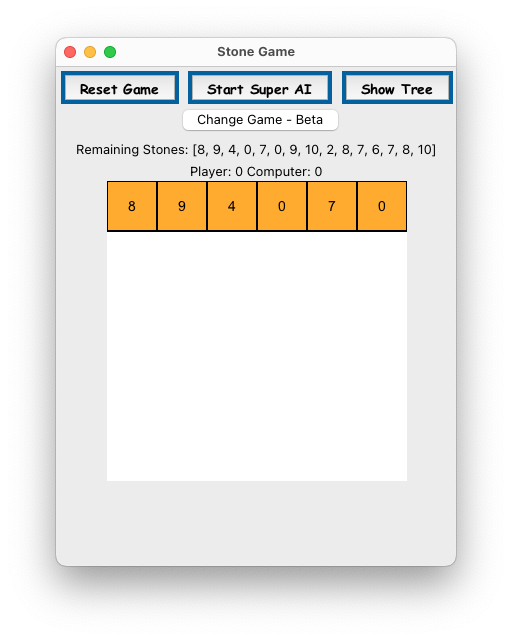

# 👾 Minimax Games

This repository is an implementation of the minimax algorithm with alpha-beta pruning for Artificial Intelligence (AI) decision-making in adversarial search and games. It includes two simple games as examples: the Stone Taking Game and Tic Tac Toe, and also game tree visualization based on the NetworkX library, that can be used to infer decision-making process of adversarial search algorithms.


---

- [Backround](#backround)
- [Algorithm desig](#algorithm-desig)
- [Example Games](#example-games)
  - [Stone Taking Game](#stone-taking-game)
    - [Features](#features)
    - [How The Algorithm Works](#how-the-algorithm-works)
  - [Tic Tac Toe](#tic-tac-toe)
- [Prerequisites](#prerequisites)
- [How to Run](#how-to-run)
- [Game Play](#game-play)
- [Minimax Algorithm with Alpha-Beta Pruning Implementation](#minimax-algorithm-with-alpha-beta-pruning-implementation)
- [Feedback](#feedback)
- [License](#license)

---

## Backround

<p align="center">
    
    <em>Minimax Decision Tree for the Stone Taking Game. The Red Nodes Represent the Min ply and the Blue Nodes Represent the Max ply. The Numbers on the Nodes Represent the different between the Max and Min scores.</em>
</p>


A game tree is a tree-like structure that represents the possible moves and outcomes of a game. It is not very practicle to use since the number of nodes in the tree grows exponentially with the depth of the tree. For example, if we have a game with only 2 options for each move and the depth of the tree is 10, we will have $2^10 = 1024$ nodes(!). In complex games like chess, the number of nodes can reach $10^{120}$, which is more than the number of atoms in the universe.

The minimax algorithm is a decision-making algorithm that is used to find the optimal move for a player in a game. It is an improved version of the brute force algorithm, which evaluates all possible moves and their outcomes. The idea is that for some games, we can predict the outcome of the game if both players play optimally, without evaluating all the possible moves. For example, if we have this kind of board in Tic Tac Toe:

$$
\left(\begin{array}{ccc}
  &   &  X\\
O &  & \\
X & O & X
\end{array}\right)
$$

Than no matter what move O will make - X can win the game. Try it! This is why we can stop evaluating the game tree after we find moves that the other player can make that will make us lose the game.

The minimax works by evaluating the game tree in a recursive manner. It starts from the root of the tree and expand the tree until it reaches a terminal (leaf) node. For example:

$$
\left(\begin{array}{ccc}
  &   & [X]\\
O & [X] & O\\
[X] & O & X
\end{array}\right)
$$

Is a terminal node since X can win the game. The algorithm then evaluates the utility of the node and returns it to the parent node. The parent node then evaluates the utility of its children. Than comes the tricky part - Lets say that the parent node is the first player (max node) and the children are the second player (min nodes). The algorithm will pick the opposite of what you might think - it will pick the minimum utility of the children: max node will pick the maximum of the minimums and the min node will pick the minimum of the maximums. This is why it is called minimax. Personally, I think it makes it easier to think about it as the least worst option for the player.

The algorithm than backtracks the utility of the children to the parent node up to the root node, wich will be able to pick the best move for the player.


## Algorithm desig

```python
class GameLogic:
    """
    GameLogic class
    """

    def __init__(self):
        self.state = []
        self.rules = ""
        self.player_score = 0
        self.computer_score = 0

    def actions(self, state: List[int]) -> List[int]:
        """
        Generates a list of possible actions based on the current state
        """
        pass

    def result(self, state: List[int], action: int) -> (List[int], int):
        """
        Returns the resulting state gained by applying the action to the current state
        """
        pass

    def is_terminal(self, state: List[int]) -> str:
        """
        Determines whether the current state is a terminal state
        """
        pass

    def utility(self, state: List[int], player: int) -> int:
        """
        Determines the utility of the current state based on the player and the game type
        """
        pass


    def __type__(self):
        """
        return the type of the game
        """
        pass
```

The program implements the concept of the minimax algorithm and alpha-beta pruning regardless to the type of the game. The Game logic is fully encapsulated in the `GameLogic` class above, which is a base class for the games, and could be used to any other game as well. The `StoneGame` and `TicTacToe` classes are implemented as an example of how to use the `GameLogic` class.

```python
# minimax algorithm with alpha-beta pruning - from the Minimax class
    def max_value(self, state: List[int], alpha: int, beta: int, depth: int, iterations: int = 4) -> (int, int):
        """
        Returns the maximum value and the action that leads to that value
        """
        if self.game.is_terminal(state, MAX):
            utility = self.game.utility(state, MAX)
            self.game_tree.updtne

        best_move = None
        v = -inf # initial value of max node
        for a in self.game.actions(state):
            new_state = self.game.result(state, a)
            v2, a2 = self.min_value(
                new_state, alpha, beta, depth + 1, iterations - 1)
            if v < v2:
                v = v2
                # should not get -1 as a move
                if a2 is not None:
                    best_move = a2
                else:
                    best_move = a
            alpha = max(alpha, v2)
            if beta <= v:
                break
        # updating best move and value wile backtracking
        return v, best_move

    def min_value(self, state: List[int], alpha: int, beta: int, depth: int, iterations: int = 4) -> (int, int):
        """
        Returns the minimum value and the action that leads to that value
        """
        v = inf
        best_move = None

        if self.game.is_terminal(state, MIN):
            v = self.game.utility(state, MIN)
        else:
            for a in self.game.actions(state):
                new_state = self.game.result(state, a)
                v2, a2 = self.max_value(
                    new_state, alpha, beta, depth + 1, iterations-1)
                if v > v2:
                    if a2 is not None:
                        best_move = a2
                    else:
                        best_move = a
                    v = v2
                beta = min(beta, v2)
                if v <= alpha:
                    break
        return v, best_move

```

## Example Games

Each game utilizes a the `Game` class, which is a base class for the games. It contains the transition function, which is used to generate the next state of the game, and the utility function, which is used to evaluate the game state. The `StoneGame` and `TicTacToe` classes inherit from the `Game` class and implement their own transition and utility functions.

<table align="center" tyle="border: none; border-collapse: collapse; margin: 0 auto; padding: 0; text-align: center; border-spacing: 0; border-collapse: collapse; width: 100%; border: 1px solid #e0e0e0;">
    <tr>
        <td align="center">
            
        </td>
        <td align="center">
            
        </td>
    </tr>
</table>

### Stone Taking Game

A simple yet engaging game where you compete against the computer in taking stones from a pile. The game is a fun mix of strategy and luck, designed to provide an entertaining challenge. It employs a graphical user interface (GUI) for interaction and visualizes the game strategy using a minimax algorithm tree.

This game was originally presented in the hard leetcode problem [https://leetcode.com/problems/stone-game-iii/](https://leetcode.com/problems/stone-game-iii/). This implementation is not applicable to the leetcode problem, but it is a fun game to play. Its purpose is to demonstrate the minimax algorithm and provide an interactive experience for players, while also offering insight into the game's decision-making process and the alpha-beta pruning algorithm.

#### Features

- **Player vs. Computer Gameplay**: Take turns with the computer to remove 1-3 stones from the pile.
- **Minimax Algorithm**: The computer calculates its moves using the minimax algorithm, ensuring a challenging game.
- **GUI Interaction**: The game uses Tkinter for the GUI, making it interactive and user-friendly.
- **Visualization**: Utilizes NetworkX for visualizing the minimax strategy tree, offering insight into the game's decision-making process.
- **Dynamic Stone Pile**: The number of stones and their values in the pile can be randomized for each game, ensuring a unique experience every time.

#### How The Algorithm Works

The Algorithm implementation uses the different between the player and the computer scores as the utility of the game. This lead to the first player (max node) to try to maximize the utility of the game, and the second player (min node) to try to minimize the utility of the game , wich is equivalent to maximize his own utility (less for player 1 mean more for player 2).

### Tic Tac Toe


A classic game of Tic Tac Toe with a twist! The game features a graphical user interface (GUI) for interaction and visualizes the game strategy using a minimax algorithm tree. It is designed to provide an engaging and interactive experience for players while demonstrating the minimax algorithm's capabilities.

Note that the algorithm works better when it starts, but it can be changed to start with the second player as well.

<p align="center">
    
    <em>Tic Tac Toe Minimax Decision Tree</em>
</p>

## Prerequisites

Before running the game, ensure you have the following installed:

- Python 3.x
- Tkinter
- NetworkX
- Matplotlib
- PyDot (for tree visualization)

## How to Run

1. Clone the repository or download the game file.
2. Ensure you have all the necessary libraries installed.
3. Run the script using Python:

```bash
python3 main.py
```

## Game Play

1. **Starting the Game**: Upon launching, the game will display a pile of stones with randomized values.
2. **Making a Move**: Enter the number of stones you wish to take (1, 2, or 3) and click "Take Stones".
3. **Computer's Turn**: After your move, the computer will calculate its best move and take stones accordingly.
4. **Visualization**: Click "Show Tree" to visualize the minimax decision tree for the current state of the game.
5. **End of Game**: The game ends when there are no more stones to take. The player with the most stones wins.

## Minimax Algorithm with Alpha-Beta Pruning Implementation

## Feedback

We love to hear from players! If you have any feedback, suggestions, or issues, please open an issue in the repository.

Enjoy the game and may the best strategist win!

## License

This project is licensed under the MIT License - see the [LICENSE](LICENSE) file for details.
