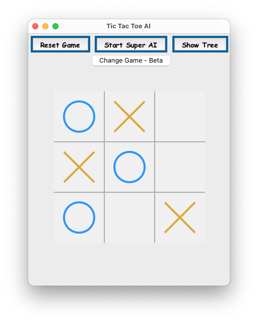

# 👾 Minimax Games

This repository contains two simple games that utilize the minimax algorithm for decision-making. The games are designed to provide an interactive and engaging experience for players while demonstrating the minimax algorithm's capabilities, including `alpha-beta pruning` and decision tree visualization.

<p align="center">
    
    <em>Minimax Decision Tree for the Stone Taking Game. The Red Nodes Represent the Min ply and the Blue Nodes Represent the Max ply. The Numbers on the Nodes Represent the different between the Max and Min. The Computer will choose the path with the highest number if playes Max and the lowest number if playes Min.</em>
</p>

---

- [Games](#games)
  - [Stone Taking Game](#stone-taking-game)
    - [Features](#features)
  - [Tic Tac Toe](#tic-tac-toe)
- [Prerequisites](#prerequisites)
- [How to Run](#how-to-run)
- [Game Play](#game-play)
- [Minimax Algorithm with Alpha-Beta Pruning Implementation](#minimax-algorithm-with-alpha-beta-pruning-implementation)
- [Feedback](#feedback)
- [License](#license)

---

## Games

Each game utilizes a the `Game` class, which is a base class for the games. It contains the transition function, which is used to generate the next state of the game, and the utility function, which is used to evaluate the game state. The `StoneGame` and `TicTacToe` classes inherit from the `Game` class and implement their own transition and utility functions.

<table align="center" tyle="border: none; border-collapse: collapse; margin: 0 auto; padding: 0; text-align: center; border-spacing: 0; border-collapse: collapse; width: 100%; border: 1px solid #e0e0e0;">
    <tr>
        <td align="center">
            
        </td>
        <td align="center">
            
        </td>
    </tr>
</table>

### Stone Taking Game

A simple yet engaging game where you compete against the computer in taking stones from a pile. The game is a fun mix of strategy and luck, designed to provide an entertaining challenge. It employs a graphical user interface (GUI) for interaction and visualizes the game strategy using a minimax algorithm tree.

This game was originally presented in the hard leetcode problem [https://leetcode.com/problems/stone-game-iii/](https://leetcode.com/problems/stone-game-iii/). This implementation is not applicable to the leetcode problem, but it is a fun game to play. Its purpose is to demonstrate the minimax algorithm and provide an interactive experience for players, while also offering insight into the game's decision-making process and the alpha-beta pruning algorithm.

#### Features

- **Player vs. Computer Gameplay**: Take turns with the computer to remove 1-3 stones from the pile.
- **Minimax Algorithm**: The computer calculates its moves using the minimax algorithm, ensuring a challenging game.
- **GUI Interaction**: The game uses Tkinter for the GUI, making it interactive and user-friendly.
- **Visualization**: Utilizes NetworkX for visualizing the minimax strategy tree, offering insight into the game's decision-making process.
- **Dynamic Stone Pile**: The number of stones and their values in the pile can be randomized for each game, ensuring a unique experience every time.

### Tic Tac Toe

A classic game of Tic Tac Toe with a twist! The game features a graphical user interface (GUI) for interaction and visualizes the game strategy using a minimax algorithm tree. It is designed to provide an engaging and interactive experience for players while demonstrating the minimax algorithm's capabilities.

<p align="center">
    
    <em>Tic Tac Toe Minimax Decision Tree</em>
</p>

## Prerequisites

Before running the game, ensure you have the following installed:

- Python 3.x
- Tkinter
- NetworkX
- Matplotlib
- PyDot (for tree visualization)

## How to Run

1. Clone the repository or download the game file.
2. Ensure you have all the necessary libraries installed.
3. Run the script using Python:

```bash
python3 main.py
```

## Game Play

1. **Starting the Game**: Upon launching, the game will display a pile of stones with randomized values.
2. **Making a Move**: Enter the number of stones you wish to take (1, 2, or 3) and click "Take Stones".
3. **Computer's Turn**: After your move, the computer will calculate its best move and take stones accordingly.
4. **Visualization**: Click "Show Tree" to visualize the minimax decision tree for the current state of the game.
5. **End of Game**: The game ends when there are no more stones to take. The player with the most stones wins.

## Minimax Algorithm with Alpha-Beta Pruning Implementation

```python
    def max_value(self, state: List[int], alpha: int, beta: int, dif: int, tree_level: int) -> (int, int):
        if len(state) == 0:
            return self.utility(state, dif), 0

        move = 0
        v = -inf
        for a in self.actions(state):
            newState, score = self.result(state, a)
            v2, a2 = self.min_value(
                newState, alpha, beta, dif + score, tree_level + 1)
            if v < v2:
                v = v2
                if a2 != 0:
                    move = a2
                else:
                    move = a
            alpha = max(alpha, v2)
            if beta <= v:
                break
        return v, move

    def min_value(self, state: List[int], alpha: int, beta: int, dif: int, tree_level: int) -> (int, int):
        if len(state) == 0:
            return self.utility(state, dif), 0

        v = inf
        move = 0
        for a in self.actions(state):
            newState, score = self.result(state, a)

            v2, a2 = self.max_value(
                newState, alpha, beta, dif - score, tree_level + 1)
            if v > v2:
                if a2 != 0:
                    move = a2
                else:
                    move = a
                v = v2
            beta = min(beta, v2)
            if v <= alpha:
                break
        return v, move
```

## Feedback

We love to hear from players! If you have any feedback, suggestions, or issues, please open an issue in the repository.

Enjoy the game and may the best strategist win!

## License

This project is licensed under the MIT License - see the [LICENSE](LICENSE) file for details.

